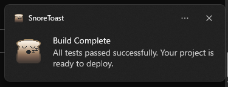
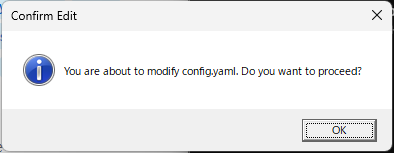

# mcp-win-toast

An MCP (Model Context Protocol) server that lets AI assistants send Windows toast notifications and dialog boxes. Give your AI a voice on your desktop.

## Why mcp-win-toast?

AI assistants are powerful — but they work silently in the background. With mcp-win-toast, your AI can **actively notify you** through native Windows UI, turning it into a true desktop companion.

## Use Cases

### Long Task Completion Alert
Ask the AI to analyze a large codebase, generate a report, or run a complex workflow — and get a toast notification the moment it's done. No need to keep watching the screen.

> "Refactor all the API endpoints, and notify me when you're finished."

### Scheduled Reminders
Combine with other MCP tools to set up reminders that pop up as native Windows notifications.

> "Remind me in 30 minutes to check the deployment status."

### Build & Test Result Notifications
Let the AI run your build pipeline or test suite and push the result as a toast — pass or fail, you'll know right away.

> "Run the tests and show me a toast with the results."

### Important Decision Checkpoints
Use dialog boxes to force a pause and get explicit user confirmation before the AI proceeds with a critical action.

> "Before deleting any files, show me a dialog to confirm."

### System Monitoring Alerts
Have the AI periodically check disk space, CPU usage, or service health, and alert you only when something needs attention.

> "Monitor my disk space and warn me if it drops below 10GB."

## Tools

### show_toast

Displays a Windows toast notification.

| Parameter | Type | Description |
|-----------|------|-------------|
| title | string | Notification title |
| message | string | Notification body text |



### show_dialog

Displays a standard Windows dialog box with an OK button. Execution is blocked until the user clicks OK, making it ideal for confirmations and important alerts.

| Parameter | Type | Description |
|-----------|------|-------------|
| title | string | Dialog title |
| message | string | Dialog body text |



## Setup

```bash
git clone https://github.com/ShigeruWakida/mcp-win-toast.git
cd mcp-win-toast
npm install
npm run build
```

## Claude Desktop Configuration

Add the following to your `claude_desktop_config.json`:

```json
{
  "mcpServers": {
    "win-toast": {
      "command": "node",
      "args": ["C:\\path\\to\\mcp-win-toast\\build\\index.js"]
    }
  }
}
```

## Combo: mcp-win-toast + YakusokuKeeper

[YakusokuKeeper](https://github.com/ShigeruWakida/YakusokuKeeper) is an MCP server that enforces rules on Claude's behavior based on time, input count, or first interaction. By combining it with mcp-win-toast, you can build a **self-managing AI assistant** that notifies you at the right moments — automatically, without being asked.

### Break Reminder

Add a time-based rule in YakusokuKeeper to remind you to take a break every 30 minutes, delivered as a toast notification.

YakusokuKeeper rule:
```yaml
time_based:
  - rule: "Call show_toast with title 'Break Time' and message 'You have been working for 30 minutes. Stand up and stretch!'"
    minutes: 30
```

### Progress Report at Regular Intervals

Have Claude automatically summarize what it has done every 10 interactions and notify you.

YakusokuKeeper rule:
```yaml
input_count:
  - rule: "Summarize what you have accomplished so far in 2-3 bullet points, then call show_toast with title 'Progress Report' and the summary as the message."
    count: 10
```

### Welcome Briefing on Session Start

Greet the user with a toast notification and a quick status overview at the beginning of every session.

YakusokuKeeper rule:
```yaml
first_time:
  - rule: "Call show_toast with title 'Session Started' and message 'Hello! Ready to assist you. Let me know what you need.' as a greeting."
```

### Critical File Protection

Show a blocking dialog for confirmation whenever Claude is about to modify important files.

YakusokuKeeper rule:
```yaml
first_time:
  - rule: "Before editing any file matching *.env, *.config, or docker-compose.*, always call show_dialog with title 'Confirm Edit' and a message describing which file you are about to modify. Wait for the user to acknowledge before proceeding."
```

### Session Duration Warning

Warn the user with a dialog box after a long session so they can decide whether to continue.

YakusokuKeeper rule:
```yaml
time_based:
  - rule: "Call show_dialog with title 'Long Session' and message 'You have been working for over an hour. Would you like to wrap up or continue?' to check in with the user."
    minutes: 60
```

### Prompt Examples for Claude Code

You can also give these instructions directly as prompts in Claude Code:

```
Every time you finish a task, send me a toast notification with a brief summary.
```

```
If you are about to delete or overwrite any file, show a dialog box to confirm before proceeding.
```

```
After every 5 messages, show a toast with a short progress update of what we have accomplished.
```

## Requirements

- Windows 10 / 11
- Node.js 18+

## License

ISC
